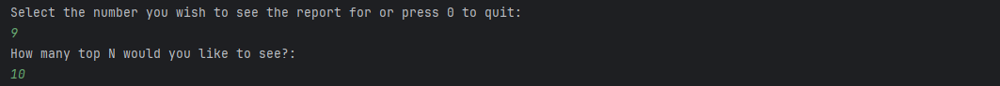

# Software Engineering Methods

* Master Build Status 

* Develop Branch Status 

* License 

* Release 

* Code coverage 

## How to use our report system:
### Installation on your laptop 
1. Open Docker 
2. Connect to Docker from "Services" by clicking the green arrow
3. Once connected make sure all your previous images are removed
4. Go to the `docker-compose.yml` file and run the `db` service to start the container. 
5. Check that `db/sem-coursework-db-1` is ready for connection
6. Once that is completed, go to the App class and run `App.Main()`
7. The App will start by making a connection to the database, and once successfully connected 
    you will see the following message running in the Terminal where the user can interact with 
    system and decide that report they wish to retrieve

### User Interaction
1. The user is prompted to select a report by entering the corresponding number. 
2. The application will wait for a user input for 20 seconds. 
3. When there is no input in the terminal for the first 20 seconds, the system will default to option 1.
   This is a workaround to facilitate both an interactive mode with the terminal for the users, and an
   automated execution in the pipeline.
4. Upon receiving a user selection, the application retrieves the requested data from the database and displays it in a formatted table in the console. 
   The tables show detailed information about countries, cities, capital cities, populations, and languages, depending on the report type selected by the user.
5. When it comes to the TopN methods, the system will prompt the user to select N to display the amount of countries/cities they wish to see.

6. The process of displaying options and waiting for user input repeats, allowing users to generate multiple reports in a single session. The loop continues until the user decides to exit by pressing 0.
7. Either if the user selects "0" or the application defaults to option 1 after the 20 seconds, the application disconnects from the database
   and terminates the application by thanking the user for using the system. 

### Requirement table 
| ID | Name                                                                                                                                       | Met | Screenshot                                                      |
|----|--------------------------------------------------------------------------------------------------------------------------------------------|-----|-----------------------------------------------------------------|
| 1  | All the countries in the world organised by largest population to smallest.                                                                | Yes | [View Screenshot](Screenshots/1-AllCountries-ByWorld.png)       |
| 2  | All the countries in a continent organised by largest population to smallest.                                                              | Yes | [View Screenshot](Screenshots/2-AllCountries-ByContinent.png)   |
| 3  | All the countries in a region organised by largest population to smallest.                                                                 | Yes | [View Screenshot](Screenshots/3-AllCountries-ByRegion.png)      |
| 4  | List of cities in the world by population in descending order                                                                              | Yes | [View Screenshot](Screenshots/4-AllCities-ByWorld.png)          |
| 5  | List of cities of a continent by population in descending order                                                                            | Yes | [View Screenshot](Screenshots/5-AllCities-ByContinent.png)      |
| 6  | List of cities in a region by population in descending order                                                                               | Yes | [View Screenshot](Screenshots/6-AllCities-ByRegion.png)         |
| 7  | List of cities in a country by population in descending order                                                                              | Yes | [View Screenshot](Screenshots/7-AllCities-ByCountry.png)        |
| 8  | List of cities in a district by population in descending order                                                                             | Yes | [View Screenshot](Screenshots/8-AllCities-ByDistrict.png)       |
| 9  | Top populated countries in the world                                                                                                       | Yes | [View Screenshot](Screenshots/9-TopNCountries-ByWorld.png)      |
| 10 | Top populated countries in a continent                                                                                                     | Yes | [View Screenshot](Screenshots/10-TopNCountries-ByContinent.png) |
| 11 | Top populated countries in a region                                                                                                        | Yes | [View Screenshot](Screenshots/11-TopNCountries-ByRegion.png)    |
| 12 | Top populated cities in the world                                                                                                          | Yes | [View Screenshot](Screenshots/12-TopNCities-ByWorld.png)        |
| 13 | Top populated cities in a continent                                                                                                        | Yes | [View Screenshot](Screenshots/13-TopNCities-ByContinent.png)    |
| 14 | Top populated cities in a region                                                                                                           | Yes | [View Screenshot](Screenshots/14-TopNCities-ByRegion.png)       |
| 15 | Top populated cities in a country                                                                                                          | Yes | [View Screenshot](Screenshots/15-TopNCities-ByCountry.png)      |
| 16 | Top populated cities in a district                                                                                                         | Yes | x                                                               |
| 17 | List of capital cities in the world by population in descending order                                                                      | Yes | x                                                               |
| 18 | List of capital cities in a continent by population in descending order                                                                    | Yes | x                                                               |
| 19 | List of capital cities in a region by population in descending order                                                                       | Yes | x                                                               |
| 20 | Top populated capital cities in the world in descending order                                                                              | Yes | x                                                               |
| 21 | Top populated capital cities in a continent in descending order                                                                            | Yes | x                                                               |
| 22 | Top populated capital cities in a region in descending order                                                                               | Yes | x                                                               |
| 23 | Total population of people within and outside of cities in each continent                                                                  | Yes | x                                                               |
| 24 | Total population of people within and outside of cities in each region                                                                     | Yes | x                                                               |
| 25 | Total population of people within and outside of cities in each country                                                                    | Yes | x                                                               |
| 26 | Display the total population, population of people within and outside of cities in the world                                               | Yes | x                                                               |
| 27 | Display the total population, population of people within and outside of cities in a continent                                             | Yes | x                                                               |
| 28 | Display the total population, population of people within and outside of cities in a region                                                | Yes | x                                                               |
| 29 | Display the total population, population of people within and outside of cities in a country                                               | Yes | x                                                               |
| 30 | Display the total population of people in a district                                                                                       | Yes | x                                                               |
| 31 | Display the total population of people in a city                                                                                           | Yes | x                                                               |
| 32 | Display the total number of people who speak certain languages in the world, as well as this total as a percentage of the world population | Yes | x                                                               |

