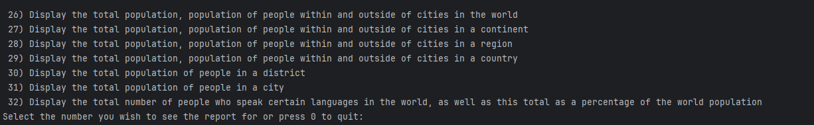

# Software Engineering Methods

* Master Build Status 

* Develop Branch Status 

* License [](https://github.com/soto-nicole/sem-coursework/blob/master/LICENSE)

* Release [](https://github.com/soto-nicole/sem-coursework/releases)

* Code coverage [](https://codecov.io/gh/soto-nicole/sem-coursework)


## How to use our report system:
### Installation on your laptop 
1. Open Docker 
2. Connect to Docker from "Services" by clicking the green arrow
3. Once connected make sure all your previous images are removed
4. Go to the `docker-compose.yml` file and run the `db` service to start the container. 
5. Check that `db/sem-coursework-db-1` is ready for connection
6. Once that is completed, go to the App class and run `App.Main()`
7. The App will start by making a connection to the database, and once successfully connected 
    you will see the following message running in the Terminal where the user can interact with 
    system and decide that report they wish to retrieve




### User Interaction
1. The user is prompted to select a report by entering the corresponding number. 
2. The application will wait for a user input for 20 seconds. 
3. When there is no input in the terminal for the first 20 seconds, the system will default to option 1.
   This is a workaround to facilitate both an interactive mode with the terminal for the users, and an
   automated execution in the pipeline.
4. Upon receiving a user selection, the application retrieves the requested data from the database and displays it in a formatted table in the console. 
   The tables show detailed information about countries, cities, capital cities, populations, and languages, depending on the report type selected by the user.
5. When it comes to the TopN methods, the system will prompt the user to select N to display the amount of countries/cities they wish to see.


6. The process of displaying options and waiting for user input repeats, allowing users to generate multiple reports in a single session. The loop continues until the user decides to exit by pressing 0.
7. Either if the user selects "0" or the application defaults to option 1 after the 20 seconds, the application disconnects from the database
   and terminates the application by thanking the user for using the system. 


### Requirement table 

```text
There are a total of 32 requirements for this assignment, and 32 of them have been met, which is 100%.
```

| ID | Name                                                                                                                                                                 | Met | Screenshot                                                             |
|----|----------------------------------------------------------------------------------------------------------------------------------------------------------------------|-----|------------------------------------------------------------------------|
| 1  | All the countries in the world organised by largest population to smallest.                                                                                          | Yes | [View Screenshot](Screenshots/1-AllCountries-ByWorld.png)              |
| 2  | All the countries in a continent organised by largest population to smallest.                                                                                        | Yes | [View Screenshot](Screenshots/2-AllCountries-ByContinent.png)          |
| 3  | All the countries in a region organised by largest population to smallest.                                                                                           | Yes | [View Screenshot](Screenshots/3-AllCountries-ByRegion.png)             |
| 4  | All the cities in the world by population in descending order                                                                                                        | Yes | [View Screenshot](Screenshots/4-AllCities-ByWorld.png)                 |
| 5  | All the cities in a continent by population in descending order                                                                                                      | Yes | [View Screenshot](Screenshots/5-AllCities-ByContinent.png)             |
| 6  | All the cities in a region by population in descending order                                                                                                         | Yes | [View Screenshot](Screenshots/6-AllCities-ByRegion.png)                |
| 7  | All the cities in a country by population in descending order                                                                                                        | Yes | [View Screenshot](Screenshots/7-AllCities-ByCountry.png)               |
| 8  | All the cities in a district by population in descending order                                                                                                       | Yes | [View Screenshot](Screenshots/8-AllCities-ByDistrict.png)              |
| 9  | Top N populated countries in the world in descending order                                                                                                           | Yes | [View Screenshot](Screenshots/9-TopNCountries-ByWorld.png)             |
| 10 | Top N populated countries in a continent in descending order                                                                                                         | Yes | [View Screenshot](Screenshots/10-TopNCountries-ByContinent.png)        |
| 11 | Top N populated countries in a region in descending order                                                                                                            | Yes | [View Screenshot](Screenshots/11-TopNCountries-ByRegion.png)           |
| 12 | Top N populated cities in the world in descending order                                                                                                              | Yes | [View Screenshot](Screenshots/12-TopNCities-ByWorld.png)               |
| 13 | Top N populated cities in a continent in descending order                                                                                                            | Yes | [View Screenshot](Screenshots/13-TopNCities-ByContinent.png)           |
| 14 | Top N populated cities in a region in descending order                                                                                                               | Yes | [View Screenshot](Screenshots/14-TopNCities-ByRegion.png)              |
| 15 | Top N populated cities in a country in descending order                                                                                                              | Yes | [View Screenshot](Screenshots/15-TopNCities-ByCountry.png)             |
| 16 | Top N populated cities in a district in descending order                                                                                                             | Yes | [View Screenshot](Screenshots/16-TopNCities-ByDistrict.png)            |
| 17 | All the capital cities in the world by population in descending order                                                                                                | Yes | [View Screenshot](Screenshots/17-AllCapitalCities-ByWorld.png)         |
| 18 | All the capital cities in a continent by population in descending order                                                                                              | Yes | [View Screenshot](Screenshots/18-AllCapitalCities-ByContinent.png)     |
| 19 | All the capital cities in a region by population in descending order                                                                                                 | Yes | [View Screenshot](Screenshots/19-AllCapitalCities-ByRegion.png)        |
| 20 | Top N populated capital cities in the world in descending order                                                                                                      | Yes | [View Screenshot](Screenshots/20-TopNCapitalCities-ByWorld.png)        |
| 21 | Top N populated capital cities in a continent in descending order                                                                                                    | Yes | [View Screenshot](Screenshots/21-TopNCapitalCities-ByContinent.png)    |
| 22 | Top N populated capital cities in a region in descending order                                                                                                       | Yes | [View Screenshot](Screenshots/22-TopNCapitalCities-ByRegion.png)       |
| 23 | Total population of people, people living within and outside of cities in each continent                                                                             | Yes | [View Screenshot](Screenshots/23-AllPopulations-ByContinent.png)       |
| 24 | Total population of people, people living within and outside of cities in each region                                                                                | Yes | [View Screenshot](Screenshots/24-AllPopulations-ByRegion.png)          |
| 25 | Total population of people, people living within and outside of cities in each country                                                                               | Yes | [View Screenshot](Screenshots/25-AllPopulations-ByCountry.png)         |
| 26 | Display the total population, population of people within and outside of cities in the world                                                                         | Yes | [View Screenshot](Screenshots/26-SpecificPopulation-ByWorld.png)       |
| 27 | Display the total population, population of people within and outside of cities in a continent                                                                       | Yes | [View Screenshot](Screenshots/27-SpecificPopulation-ByContinent.png)   |
| 28 | Display the total population, population of people within and outside of cities in a region                                                                          | Yes | [View Screenshot](Screenshots/28-SpecificPopulation-ByRegion.png)      |
| 29 | Display the total population, population of people within and outside of cities in a country                                                                         | Yes | [View Screenshot](Screenshots/29-SpecificPopulation-ByCountry.png)     |
| 30 | Display the total population of people in a district                                                                                                                 | Yes | [View Screenshot](Screenshots/30-SpecificPopulation-ByDistrict.png)    |
| 31 | Display the total population of people in a city                                                                                                                     | Yes | [View Screenshot](Screenshots/31-SpecificPopulation-ByCity.png)        |
| 32 | Display the total number of people who speak certain languages in the world and as a total percentage of the world population, in descending order of total speakers | Yes | [View Screenshot](Screenshots/32-LanguageByPopulation-ByWorld.png)     |


### Individual Contribution

| Matriculation Number | Code Review 1 | Code Review 2 | Code Review 3 | Final Deliverable |
|----------------------|---------------|---------------|---------------|-------------------|
| 40626148             | 50            | 50            | 50            | 50                |
| 40626170             | 50            | 50            | 50            | 50                |
| **Total**            | **100**       | **100**       | **100**       | **100**           |
